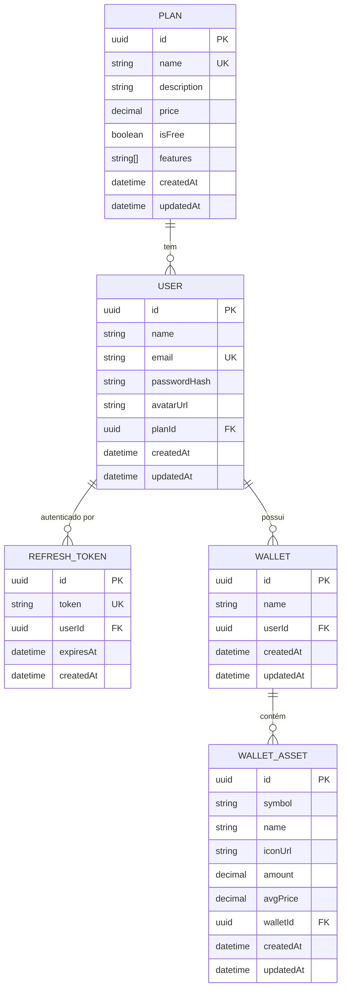

# 🪙 Ativos International — Back-end API (D4)

> **Entrega D4 — Repositório do Back-end**  
> Migrações do banco de dados, documentação Swagger ativa, Modelagem DER e implementação inicial com NestJS + Prisma ORM  
> **Discentes:** Julio Guzzo Kuster, Andrew Bertelli, Felipe Hyczy e Josué Farah  
> **Docente:** Prof. Mestre. Giovane Galvão

---

## 🎯 Sobre esta entrega

O D4 entrega a camada de back-end da plataforma, conectando a interface Next.js (D3) a um banco de dados real via API REST documentada.

| Item | Status |
|------|--------|
| Back-end NestJS com módulos | ✅ |
| Prisma ORM + PostgreSQL | ✅ |
| Migração do banco de dados | ✅ |
| Swagger UI ativo (`/api/docs`) | ✅ |
| Diagrama Entidade-Relacionamento (DER) | ✅ |
| Autenticação JWT (access + refresh token) | ✅ |
| Guards e rotas protegidas | ✅ |

---

## 🗄️ Modelagem de Banco de Dados (DER)



### 📐 Regras de Negócio no Banco

| Constraint | Tabela | Descrição |
|---|---|---|
| `UNIQUE(email)` | `users` | Email único por usuário |
| `UNIQUE(name)` | `plans` | Nome do plano único |
| `UNIQUE(userId, name)` | `wallets` | Mesmo usuário não pode ter duas carteiras com o mesmo nome |
| `UNIQUE(walletId, symbol)` | `wallet_assets` | Cada criptomoeda aparece uma vez por carteira |
| `CASCADE DELETE` | `wallets`, `wallet_assets`, `refresh_tokens` | Exclusão em cascata ao remover usuário/carteira |
| `SET NULL` | `users.planId` | Plano removido não exclui o usuário |

---

## 🏗️ Arquitetura do Back-end

```
backend/
├── src/
│   ├── main.ts                    # Bootstrap + Swagger config
│   ├── app.module.ts              # Módulo raiz
│   │
│   ├── prisma/
│   │   ├── prisma.service.ts      # PrismaClient com lifecycle hooks
│   │   └── prisma.module.ts       # Global module (exporta PrismaService)
│   │
│   ├── auth/                      # Módulo de autenticação
│   │   ├── auth.controller.ts     # POST /auth/register, /login, /refresh, /logout
│   │   ├── auth.service.ts        # Lógica de registro, login, tokens
│   │   ├── auth.module.ts
│   │   ├── dto/auth.dto.ts        # LoginDto, RegisterDto, RefreshTokenDto
│   │   ├── guards/
│   │   │   └── jwt-auth.guard.ts  # Guard de rotas protegidas
│   │   └── strategies/
│   │       └── jwt.strategy.ts    # Validação de JWT via PassportJS
│   │
│   ├── users/                     # Módulo de usuários
│   │   ├── users.controller.ts    # GET/PATCH/DELETE /users/me
│   │   ├── users.service.ts
│   │   ├── users.module.ts
│   │   └── dto/update-user.dto.ts
│   │
│   ├── wallets/                   # Módulo de carteiras
│   │   ├── wallets.controller.ts  # CRUD /wallets + /wallets/:id/assets
│   │   ├── wallets.service.ts
│   │   ├── wallets.module.ts
│   │   └── dto/wallet.dto.ts      # CreateWalletDto, UpsertAssetDto
│   │
│   └── plans/                     # Módulo de planos (público)
│       ├── plans.controller.ts    # GET /plans, /plans/:id
│       ├── plans.service.ts
│       └── plans.module.ts
│
├── prisma/
│   ├── schema.prisma              # Schema com todas as entidades
│   └── migrations/
│       └── 20260509_init/
│           └── migration.sql      # SQL da migração inicial + seed de planos
│
├── .env.example                   # Variáveis de ambiente necessárias
├── .gitignore
├── nest-cli.json
├── package.json
└── tsconfig.json
```

---

## 📄 Endpoints da API

### 🔐 Auth (público)

| Método | Rota | Descrição |
|--------|------|-----------|
| `POST` | `/api/auth/register` | Cadastrar novo usuário |
| `POST` | `/api/auth/login` | Autenticar e obter tokens |
| `POST` | `/api/auth/refresh` | Renovar access token |
| `POST` | `/api/auth/logout` | 🔒 Encerrar sessão |

### 👤 Users (protegido)

| Método | Rota | Descrição |
|--------|------|-----------|
| `GET` | `/api/users/me` | 🔒 Perfil do usuário + plano |
| `PATCH` | `/api/users/me` | 🔒 Atualizar nome / avatar |
| `DELETE` | `/api/users/me` | 🔒 Excluir conta |

### 💼 Wallets (protegido)

| Método | Rota | Descrição |
|--------|------|-----------|
| `GET` | `/api/wallets` | 🔒 Listar carteiras do usuário |
| `GET` | `/api/wallets/:id` | 🔒 Detalhes da carteira |
| `POST` | `/api/wallets` | 🔒 Criar carteira |
| `DELETE` | `/api/wallets/:id` | 🔒 Excluir carteira |
| `PUT` | `/api/wallets/:id/assets` | 🔒 Adicionar/atualizar ativo (upsert) |
| `DELETE` | `/api/wallets/:id/assets/:symbol` | 🔒 Remover ativo da carteira |

### 📋 Plans (público)

| Método | Rota | Descrição |
|--------|------|-----------|
| `GET` | `/api/plans` | Listar todos os planos |
| `GET` | `/api/plans/:id` | Detalhes de um plano |

> 🔒 = Requer `Authorization: Bearer <access_token>`

---

## 🚀 Como rodar

### Pré-requisitos
- Node.js 18+
- PostgreSQL 14+

### 1. Clone e instale

```bash
# No repositório raiz
cd backend
npm install
```

### 2. Configure o ambiente

```bash
cp .env.example .env
# Edite .env com sua DATABASE_URL e JWT_SECRET
```

### 3. Execute as migrações

```bash
npx prisma migrate dev --name init
# Isso cria as tabelas e aplica o seed dos planos
```

### 4. Inicie o servidor

```bash
npm run start:dev
```

### 5. Acesse

| URL | Descrição |
|-----|-----------|
| `http://localhost:3001/api` | API REST |
| `http://localhost:3001/api/docs` | **Swagger UI interativo** |

---

## 🔑 Tecnologias

| Tecnologia | Versão | Uso |
|---|---|---|
| NestJS | 10 | Framework back-end modular |
| Prisma ORM | 5 | ORM + migrations + type-safety |
| PostgreSQL | 14+ | Banco de dados relacional |
| @nestjs/swagger | 7 | Documentação OpenAPI 3.0 |
| PassportJS + JWT | — | Autenticação stateless |
| bcrypt | 5 | Hash de senhas |
| class-validator | 0.14 | Validação de DTOs |

---

## 🔄 Fluxo de Autenticação

```
Cliente                     API
  │                          │
  ├─ POST /auth/register ───>│ bcrypt hash + cria usuário + plano Starter
  │<─ { accessToken, refreshToken } ─┤
  │                          │
  ├─ GET /wallets ─────────>│ JWT guard valida accessToken (15 min)
  │<─ [...wallets] ──────────┤
  │                          │
  ├─ POST /auth/refresh ────>│ valida refreshToken (7 dias) + rotação
  │<─ { accessToken, refreshToken } ─┤
  │                          │
  ├─ POST /auth/logout ─────>│ deleta todos refresh tokens do usuário
  │<─ { message: "OK" } ─────┤
```

---

## 📦 Scripts úteis

```bash
npm run start:dev        # Desenvolvimento com hot reload
npm run build            # Build de produção
npm run db:migrate       # Executar migrações pendentes
npm run db:studio        # Abrir Prisma Studio (GUI do banco)
npm run db:generate      # Regenerar Prisma Client após schema changes
npm run lint             # Verificar código
```

---

## 👥 Responsabilidades D4

- **Josué Farah** — Arquitetura NestJS, módulos, guards e versionamento
- **Andrew Bertelli** — Revisão geral, clean code e documentação
- **Julio Guzzo Kuster** — Modelagem do banco e definição de regras de negócio
- **Felipe Hyczy** — Integração com schema Prisma e migrations

Padrão de commits: **Conventional Commits 1.0.0**
